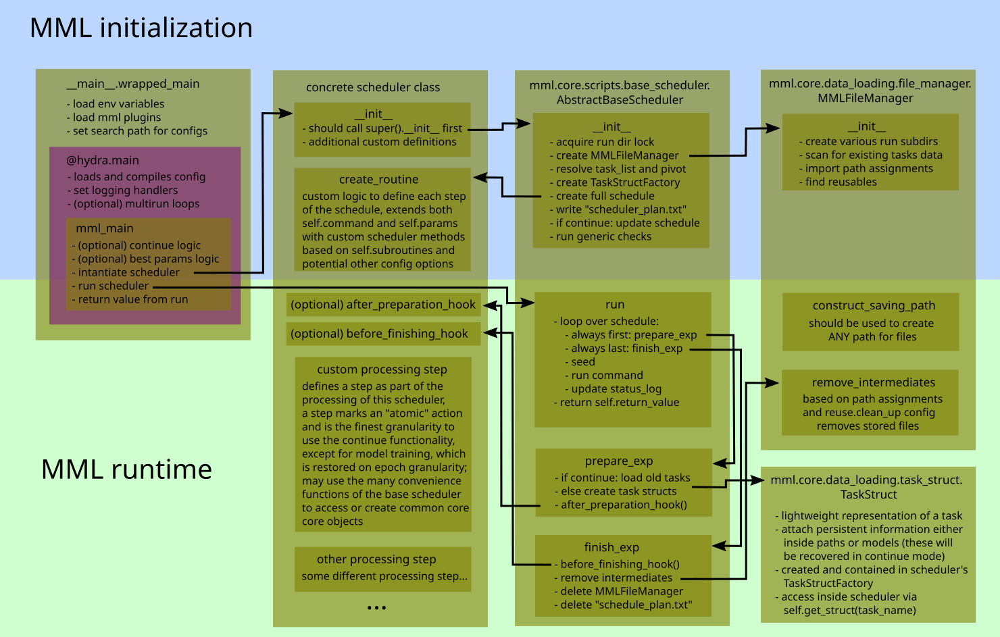

API components overview
=======================

The internals of ``mml`` may appear deeply intertwined at the beginning. The following figure shows the main components
that interact with each other during a standard experiment.

For full ``mml-core`` internals see :doc:`overview`. For an overview on plugins see :doc:`plugins/overview`.

The following quickly introduces the shown core components.

scheduler
---------

The scheduler determines the single steps each experiment runs through. It is determined by the
``mode.scheduler._target_`` entry of the compiled ``hydra`` config. A sample entry would be
``mml.core.scripts.create_scheduler.CreateScheduler``. The main loop instantiates the referred scheduler and hands over
the config. Internally the scheduler creates all other required objects (more precisely this is handled by
:class:`~mml.core.scripts.base_scheduler.AbstractBaseScheduler`). Usually inherited scheduler implement the following

  * an ``__init__``, calling ``super().__init__()`` providing ``cfg`` and ``available_subroutines``
  * an ``create_routine``, where based on ``self.subroutines`` both ``self.commands`` and ``self.params`` are extended
  * optionally the ``after_preparation_hook`` and ``before_finishing_hook`` may be overwritten
  * methods that reflect the actual data processing and are added to ``self.commands`` within ``create_routine``

These methods should reflect "atomic" steps in the processing (e.g. training of a single neural network), but not mix
multiple processing steps (e.g. training and prediction). The underlying idea is that
:class:`~mml.core.scripts.base_scheduler.AbstractBaseScheduler` keeps close track on the progress and may, if interrupted
during runtime, restart at the very atomic processing step the interruption happened. This ``continue`` functionality
is described in more detail in :doc:`../usage`. The :meth:`~mml.core.scripts.base_scheduler.AbstractBaseScheduler.run`
method will iterate over all entries of :attr:`~mml.core.scripts.base_scheduler.AbstractBaseScheduler.commands` and call
them with the corresponding parameters listed in :attr:`~mml.core.scripts.base_scheduler.AbstractBaseScheduler.params`.

Within those steps various convenience methods and attributes of
:class:`~mml.core.scripts.base_scheduler.AbstractBaseScheduler` can be used:

  * :meth:`~mml.core.scripts.base_scheduler.AbstractBaseScheduler.get_struct` returns a ``TaskStruct``
  * :meth:`~mml.core.scripts.base_scheduler.AbstractBaseScheduler.create_trainer` returns a ``Trainer``
  * :meth:`~mml.core.scripts.base_scheduler.AbstractBaseScheduler.create_model` returns a ``model``
  * :meth:`~mml.core.scripts.base_scheduler.AbstractBaseScheduler.create_datamodule` returns a ``datamodule``
  * :meth:`~mml.core.scripts.base_scheduler.AbstractBaseScheduler.lightning_tune` can tune learning rate and batch size of a model
  * :attr:`~mml.core.scripts.base_scheduler.AbstractBaseScheduler.cfg` allows access to the compiled ``config``
  * :attr:`~mml.core.scripts.base_scheduler.AbstractBaseScheduler.fm` allows access to the current ``MMLFileManager``
  * :attr:`~mml.core.scripts.base_scheduler.AbstractBaseScheduler.pivot` is an (optional) prominent task within the current task list
  * :attr:`~mml.core.scripts.base_scheduler.AbstractBaseScheduler.return_value` represents the value that will be returned once the scheduler run all commands

A consequence of the "atomic" character of scheduler methods is the necessity to store intermediate results as files, to
be persistent after a crash and reusable with ``continue`` flag. The paths to these files should be attached to the
:class:`~mml.core.data_loading.task_struct.TaskStruct` via the ``paths`` attribute (except for ``models``). See below
for more details.

file manager
------------

The :class:`~mml.core.data_loading.file_manager.MMLFileManager` is a :class:`~mml.core.scripts.utils.Singleton` and
may at any time be accessed via :meth:`~mml.core.data_loading.file_manager.MMLFileManager.instance` once it has been
initialized during :class:`~mml.core.scripts.base_scheduler.AbstractBaseScheduler`'s
:meth:`~mml.core.scripts.base_scheduler.AbstractBaseScheduler.__init__`. The file manager is the main interface for
reading and writing files within ``mml``. It is responsible to detect all installed tasks of ``mml`` and read in the
respective ``.json`` task descriptions to create the corresponding :class:`~mml.core.data_loading.task_struct.TaskStruct`.

It's main access within scheduler's custom methods is via
:meth:`~mml.core.data_loading.file_manager.MMLFileManager.construct_saving_path` which should **ALWAYS** be used to
generate saving paths for objects. Templates for the construction of such paths are provided via
:meth:`~mml.core.data_loading.file_manager.MMLFileManager.add_assignment_path` which is a class method and can and should
be called before the file manager initialization. If declared as such these paths can be reusable and shared / loaded
from other projects via ``mml``. For details of this ``reuse`` functionality see :doc:`../usage`.

A lot more magic from :class:`~mml.core.data_loading.file_manager.MMLFileManager` is happening under the hood of
``mml``. One example is the ``clean_up`` functionality. Assume that specific kind of intermediate files are not
necessary any more after a full ``run`` from the scheduler. Setting e.g. ``reuse.clean_up.parameters=true`` automatically
deletes all files of type parameter that have been created during the experiment after successful finish. Note that
``lightning`` checkpoints of model training and all files of type ``temp`` are deleted automatically.

task struct
-----------

A :class:`~mml.core.data_loading.task_struct.TaskStruct` is a lightweight representation of a task. It stores high
level information as e.g. :attr:`~mml.core.data_loading.task_struct.TaskStruct.task_type` and
:attr:`~mml.core.data_loading.task_struct.TaskStruct.num_classes`. Furthermore is is used to attach intermediate results
of scheduler methods via :attr:`~mml.core.data_loading.task_struct.TaskStruct.paths` and
:attr:`~mml.core.data_loading.task_struct.TaskStruct.models`. The former is a dictionary holding flexible string to
paths associations and the latter is a list of all trained :class:`~mml.core.scripts.model_storage.ModelStorage`s
for this task. Getting the latest :class:`~mml.core.data_loading.task_struct.TaskStruct` for a task from scheduler's
``cfg.task_list`` is achieved via :meth:`~mml.core.scripts.base_scheduler.AbstractBaseScheduler.get_struct`.

